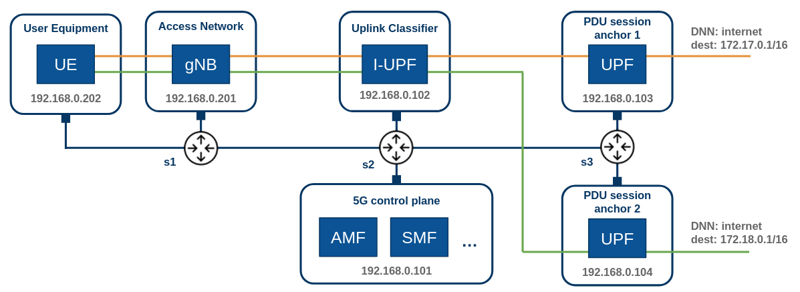

# Comnetsemu Free5GC ULCL

This project emulates a full 5G network and test the Uplink Classifier (ULCL) functionalities.

### Dependencies
- [Comnetsemu](https://git.comnets.net/public-repo/comnetsemu)
- [Free5GC](https://github.com/free5gc/free5gc)
- [UERANSIM](https://github.com/aligungr/UERANSIM)

### Network Topolgy


### Environment setup

Install the latest version of Comnetsemu in a Ubuntu 20.04 VM following one of the 
[available options](https://www.granelli-lab.org/researches/relevant-projects/comnetsemu-labs).

Inside the VM, download and install the [gtp5g kernel module](https://github.com/free5gc/gtp5g) required by the UPF.
```
git clone -b v0.6.8 https://github.com/free5gc/gtp5g.git
cd gtp5g
make
sudo make install
```
Clone this repository in the comnetsemu VM.

Build the Free5GC Docker image
```
cd free5gc
docker build --no-cache --force-rm -t free5gc .
```
Build the UERANSIM Docker image
```
cd ueransim
docker build --no-cache --force-rm -t ueransim .
```

### Running the project
